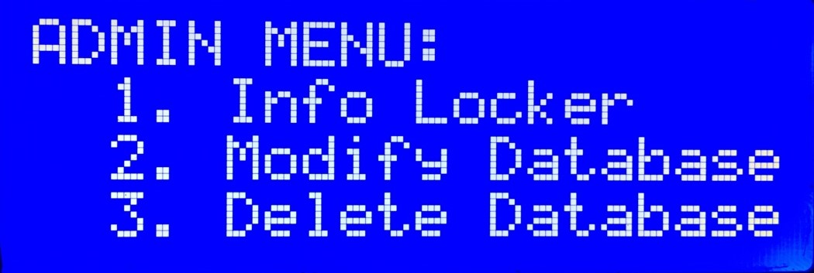

# ADMIN GUIDE

## Admin Menu
-	There are 02 admin key: the RFID card and the RFID tag.
    Usually, MIS-CTU technician will have access to the RFID tag (blue tag attached to the key of MIS-CTU). Use this tag to enter the Admin menu as followed:
    

-   **Info Locker:** This allows admin to check locker information, and open any of them.
-	**Modify Database:** This allows admin to see the system current IP and current username. With it, admin can login to the system using SSH. When logged to the system, admin can modify database or update – upgrade the system.
-	**Delete Database:** This allows admin to delete database completely without having to login to the system using SSH. **Caution:** This is irreversible!

## Modify System
You can try and play with the code of the system, and hopefully upgrade it!
However, you need to keep in mind:
-	C binary codes require permission to be executed. Therefore, whenever you change your code and update it from git, **ALWAYS** remember to call (/home/<<user>>/system/main):
```bash
chmod +x binary_renewer.sh
sudo ./binary_renewer.sh
```
**Caution:** If you forget to call these lines whenever you update your code, C binary won’t be given the needed permission, therefore could lead to wrong startup and MAY DESTROY the locker by overheating it.

## Database
Database is written in Flask.

After logging in to the system by SSH, move in to the main project folder (/home/<<user>>/system/main).

You can see the database file located there (database.db). This is an SQL database, so you can export it to any SQL system to modify it.

In case you want to modify the database directly within the system, you need to open Python shell:
```bash
sudo python3
```
First thing to do when entering the python shell is to import the needed libraries and create a database object:
```python
from database import Database
dtb = Database()
```
After importing database, you can modify it as you want (you can checkout functions listed in database.py). For example, to get all instance from the db:
```python
dtb.getAllUserInfo()
```

## Database Structure
In order to see or update database structure, you need to have a look at _models.py_ located in ./system/main/app. This is the current attribute of the database: _id, name, mssv, rfid, fing, timestamp_.
After updating attributes to the database frame, you need to migrate it into the existed database. This is made easy by Flask Migrate:
```bash
flask db migrate -m "message explain what have you changed"
flask db upgrade
```
If you see the new database frame is not good and want to return to the previous version, you can do it by using:
```bash
flask db downgrade
```

