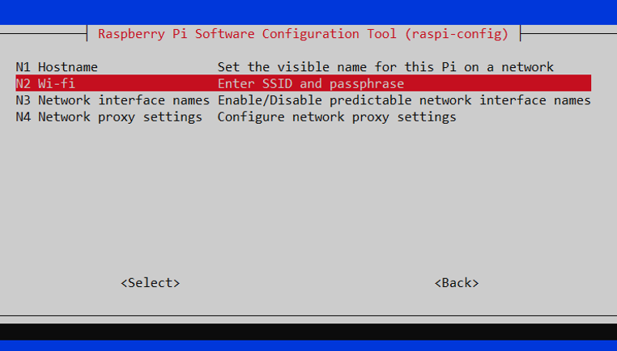
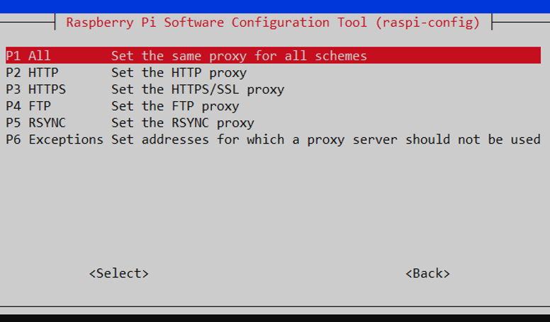
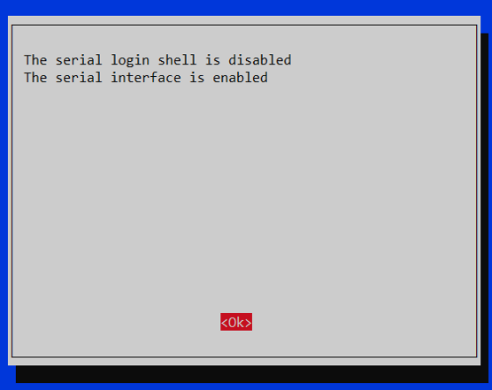
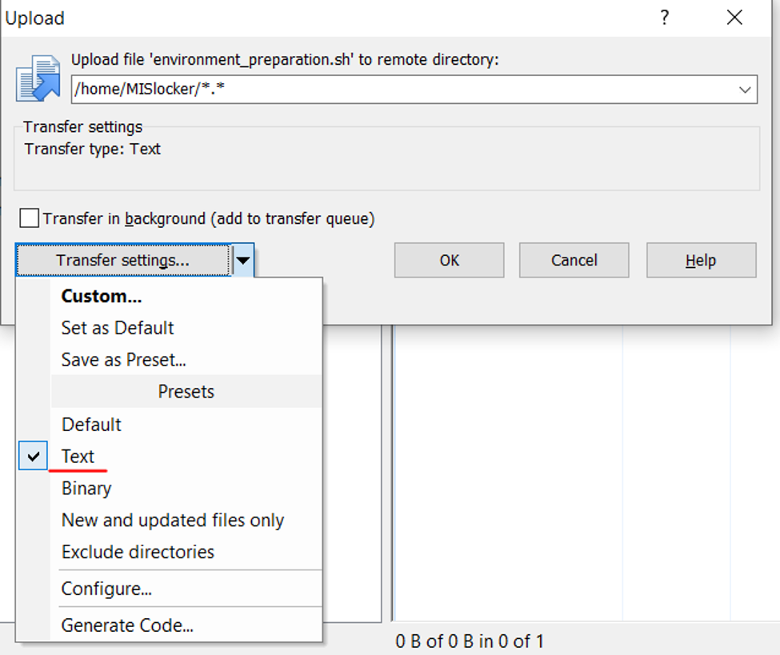

# INSTALLATION INSTRUCTION


-   <span style="color: red;"><b>Step 0: Contact to a Technician of MIS-CTU to get an img file contain everything pre-configured, flash it to SD card using Balena Etcher. If you do this step, you can skip all the steps below.</b> </span>

-   **Step 1:** download latest [Raspbian lite], flash to SD card with [Balena Etcher].
-	**Step 2:** put the SD card to a Raspberry Pi. Connect HDMI, keyboard and boot up. Sign in with user: pi, password: raspberry
-	Step 3: Config basic setting in raspi-config menu:
    -	Type in command line:
    ```bash
    sudo raspi-config
    ```
    -	Choose 2.Network options > N2 Wi-fi
    -	Choose country, then type in Wifi SSID, Wifi password

    

    -	Then continue to choose N4 Network proxy settings > P1 All
    -	Fill in proxy setting with <http://proxy.ip:port>

    

    -	Return to main menu, choose 4. Localization Options > I2 Change Timezone > Asia > Ho Chi Minh City
    -	Return to main menu, choose 5. Interfacing Options > P2 SSH > Enable
    -	Return to main menu, choose 5. Interfacing Options > P5 I2C > Enable
    -	Return to main menu, choose 5. Interfacing Options > P6 Serial > Disable login shell to be accessible over serial (No) > Enable Serial port hardware (Yes)

    

    -   Reboot to finish
-   **Step 4:** Use command ifconfig to figure out the IP of the Raspberry Pi. Log in to Raspberry Pi using WinSCP (on the same network). Copy file environment_preparation.sh to the Rasp (/home/<<user>>/). **Caution: use Text as the Transfer type**.

    

-	**Step 5:** to give execute permission to the shell script, open command line and type in:
```bash
chmod +x ./ environment_preparation.sh
```
-	**Step 6:** run command to prepare the needed environment:
```bash
sudo ./ environment_preparation.sh
```
-	**Step 7:** shutdown and put the Raspberry Pi on the system PCB, put on cables and USB connection. Start up the system, log in with SSH to check working status of the device.


<!-- Links -->
[Raspbian lite]: https://www.raspberrypi.org/downloads/raspbian/
[Balena Etcher]: https://www.balena.io/etcher/
